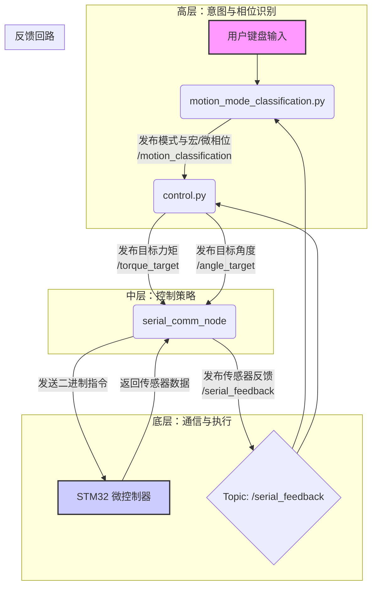

# my_robot_base

本包 包含基础节点，包括：

- `motion_mode_classification.py`：高层控制器，通过键盘接收用户意图，并结合传感器数据进行步态相位划分。
- `control.py`：中层控制器，根据高层指令和传感器反馈，执行角度或阻抗控制策略。
- `serial_comm_node`：底层通信节点，负责与微控制器（MCU）进行二进制数据收发（C++）。
- `angle_planner.py`：一个简单的轨迹规划器，用于测试。

## 控制框架与数据流

整个控制系统分为高、中、低三层，数据流形成一个闭环：



1.  **高层控制器 (`motion_mode_classification.py`)**：
    - 接收用户通过键盘输入的运动模式（如平地、上楼）。
    - 订阅 `serial_feedback` 获取传感器数据，进行步态事件检测（如足底接触/离地），划分出支撑相（Stance）和摆动相（Swing）。
    - 将整合后的分类信息（运动模式、宏观相位、微观相位）发布到 `motion_classification` 话题。

2.  **中层控制器 (`control.py`)**：
    - 订阅 `motion_classification` 获取当前运动状态。
    - 订阅 `serial_feedback` 获取实时的膝关节角度、速度等。
    - **决策**：
      - 若当前为 **支撑相**，则执行 **阻抗控制**，计算目标力矩。
      - 若当前为 **摆动相**，则执行 **角度控制**，生成目标角度轨迹。
    - 将计算出的目标力矩或目标角度发布到 `torque_target` 或 `angle_target` 话题。

3.  **底层通信 (`serial_comm_node`)**：
    - 订阅 `torque_target` 和 `angle_target` 等控制指令。
    - 将这些数值打包成二进制帧，通过串口发送给 STM32 微控制器。
    - 接收来自 STM32 的传感器数据帧，解析后以 `key=value` 字符串格式发布到 `serial_feedback` 话题，形成反馈闭环。

## 串口通信（二进制帧协议 + 可配置字段）

节点：`serial_comm_node.cpp`

- 帧格式：`[0xAA][Payload][0xBB]`（小端，pack(1) 无填充）
  - Payload 固定长度 53 字节：`10×float (40B) + 5×int16 (10B) + 3×int8 (3B)`
  - 整帧长度 55 字节/帧（含头尾 2B）

- 发送（Jetson→MCU）与接收（MCU→Jetson）使用相同的数组布局：
  - `chf[10]` 浮点通道（float）
  - `chs[5]` 16位整数通道（int16）
  - `chb[3]` 8位整数通道（int8）

- 字段命名与顺序一处配置，处处生效（无需改多处代码）
  - 在 `serial_comm_node.cpp` 顶部通过 X-macro 列表集中管理：
    - 发送浮点：`TX_CHF_FIELD_LIST`（例如：target_torque, target_angle, kp, kd）
    - 发送字节：`TX_CHB_FIELD_LIST`（例如：mode, macro, phase_idx）
    - 接收浮点：`RX_CHF_FIELD_LIST`（例如：knee, vel, torque, curr）
    - 接收短整：`RX_CHS_FIELD_LIST`（例如：foot_contact）
  - 你可以在上述列表里增删/改名/换序，代码会自动：
    - 生成对应的成员变量
    - 生成参数（索引映射）名，如 `tx_chf_kp_idx`、`rx_chs_foot_contact_idx`
    - 打包发送 / 解析接收 / 发布 `/serial_feedback` 的 key 名
    - `/motion_classification` 的订阅赋值顺序

- 输入与输出话题：
  - 输入：
    - `/motion_classification` (std_msgs/Int32MultiArray)，按 `TX_CHB_FIELD_LIST` 顺序提供字节字段（例如 `[mode, macro, phase_idx]`）。
    - `/angle_target` (std_msgs/Float32)，浮点目标角度。
    - `/torque_target` (std_msgs/Float32)，浮点目标力矩。
  - 输出：`/serial_feedback` (std_msgs/String)，以 `key=value` 串输出，key 名来自 `RX_*_FIELD_LIST`，例如：`knee=12.300, vel=-5.100, foot_contact=1, torque=3.200, curr=0.800`。

- 可调参数：
  - 基本：
    - `port`（默认 `/dev/ttyUSB0`）
    - `baudrate`（默认 `115200`）
    - `tx_rate_hz`（默认 `50.0`）
  - 索引映射（按列表顺序给出默认值，可用参数覆盖）：
    - 发送浮点：`tx_chf_<name>_idx`，例如 `tx_chf_torque_target_idx`
    - 发送字节：`tx_chb_<name>_idx`，例如 `tx_chb_mode_idx`
    - 接收浮点：`rx_chf_<name>_idx`，例如 `rx_chf_Angle_idx`
    - 接收短整：`rx_chs_<name>_idx`，例如 `rx_chs_foot_pressure_idx`

> 吞吐量估算：55 B/帧 × 50 Hz ≈ 2.75 kB/s（约 22 kbps，8N1 计每字节10 bit 时约 27.5 kbps）。若收发同频，总占用约翻倍，仍低于 115200 bps。

### 构建

```bash
cd /path/to/your_workspace
colcon build --packages-select my_robot_base --symlink-install
source install/setup.bash
```

### 运行

```bash
# 终端1: 启动底层通信节点
ros2 run my_robot_base serial_comm_node --ros-args -p port:=/dev/ttyUSB0

# 终端2: 启动高层分类器
ros2 run my_robot_base motion_mode_classification

# 终端3: 启动中层控制器
ros2 run my_robot_base control

# 终端4 (可选): 观察传感器反馈
ros2 topic echo /serial_feedback

# 终端5 (可选): 观察目标力矩和角度
ros2 topic echo /torque_target
ros2 topic echo /angle_target
```

### 测试方法（无下位机时）

1) 使用虚拟串口对（socat）模拟 STM32 发送 Rx 帧（验证接收与 `/serial_feedback`）

```bash
# 创建虚拟串口对（输出两端路径，如 /dev/pts/5 和 /dev/pts/6）
socat -d -d pty,raw,echo=0 pty,raw,echo=0
```

在一个终端运行节点，端口指向其中一端（例如 /dev/pts/5）：

```bash
ros2 run my_robot_base serial_comm_node --ros-args -p port:=/dev/pts/5
```

在另一个终端向另一端（/dev/pts/6）写入一帧模拟数据（Python 示例，按当前固定 55B 帧格式构造）：

```bash
python3 - <<'PY'
import sys,struct,os
dev = sys.argv[1] if len(sys.argv)>1 else '/dev/pts/6'
fd = os.open(dev, os.O_WRONLY)
hdr, tail = b'\xAA', b'\xBB'

# RxPayload: < 10f 5h 3b
# 假设 RX_CHF_FIELD_LIST 中 Angle, Speed 在前两位
# 假设 RX_CHS_FIELD_LIST 中 foot_pressure 在第一位
chf = [12.3, -5.1] + [0.0]*8   # 示例: Angle=12.3, Speed=-5.1
chs = [1] + [0]*4             # 示例: foot_pressure=1
chb = [0,0,0]
payload = struct.pack('<10f5h3b', *(chf+chs+chb))
os.write(fd, hdr + payload + tail)
os.close(fd)
PY
```

此时应可在 `/serial_feedback` 看到示例：`Angle=12.300, Speed=-5.100, foot_pressure=1, ...`。

2) 验证发送帧（Tx）与控制输入：

- 运行 `motion_mode_classification` 和 `control` 节点。
- 在 `motion_mode_classification` 终端按 `0` 选择平地模式。
- 模拟 `serial_feedback`，让中层控制器进行决策。例如，模拟一个摆动相的开始（foot_contact=0）：

```bash
ros2 topic pub /serial_feedback std_msgs/String "{data: 'Angle=0.0, Speed=10.0, foot_pressure=0'}" -1
```
- 此时 `control` 节点应开始在 `/angle_target` 上发布目标角度。
- 在虚拟串口的另一端接收并解析（Python 示例）观察 55B 帧头尾与 `chf` 数组中的目标角度值：

```bash
python3 - <<'PY'
import sys,os,struct
dev = sys.argv[1] if len(sys.argv)>1 else '/dev/pts/6'
fd = os.open(dev, os.O_RDONLY)
while True:
  hdr = os.read(fd,1)
  if not hdr: break
  if hdr != b'\xAA': continue
  payload = os.read(fd,53)
  tail = os.read(fd,1)
  if len(payload)!=53 or tail!=b'\xBB': continue
  # TxPayload 同布局: <10f5h3b
  vals = struct.unpack('<10f5h3b', payload)
  # 假设 angle_target 映射到 chf[0]
  angle_target = vals[0]
  print(f'Received TX frame with angle_target: {angle_target:.2f}')
PY
```

### 如何修改字段（增删/改名/换序）

打开 `src/my_robot_base/src/serial_comm_node.cpp`，在文件顶部编辑以下列表：

- 发送浮点：`TX_CHF_FIELD_LIST`（例：删除 `X(kd)`、新增 `X(ki)`、或调整 `X(kp)`/`X(kd)` 顺序）
- 发送字节：`TX_CHB_FIELD_LIST`（例：`X(mode) X(macro) X(phase_idx)`）
- 接收浮点：`RX_CHF_FIELD_LIST`（例：`X(Angle) X(Speed) X(Torque_Motor)`）
- 接收短整：`RX_CHS_FIELD_LIST`（例：`X(foot_pressure)`）

改完只需重新编译即可。若 MCU 固定了通道索引，可用参数覆盖映射（如 `tx_chf_kp_idx:=5`）。

## 高层运动模式与相位分类

节点: `motion_mode_classification.py`

### 功能

- 键盘接收用户意图，选择运动模式：
  - `0` 平地
  - `1` 上楼
  - `2` 下楼
  - `3` 上坡
  - `4` 下坡
  - `h` 帮助
  - `q` 退出
- 订阅 `/serial_feedback`，根据传感器数据（如 `foot_pressure`）划分步态宏观相位（支撑/摆动）和微观相位。
- 发布整合后的分类结果 `[mode, macro_phase, micro_phase]` 到 `/motion_classification` 话题。
- QoS：Transient Local（新订阅者能获取最近一次模式）。

### 运行

构建（如果尚未构建）：

```bash
colcon build --packages-select my_robot_base --symlink-install
source install/setup.bash
```

运行节点：

```bash
ros2 run my_robot_base motion_mode_classification
```

在另一个终端观察：

```bash
ros2 topic echo /motion_classification
```

> 注意：某些 IDE 的内置终端不支持原生单键读取，程序会自动回退到“需要回车”的行输入模式。
